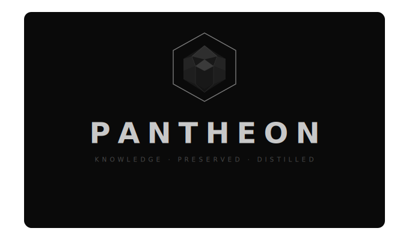

# Pantheon

<p align="center">
  
</p>

> "Elon Musk didn't invent first principles thinking. Toyota didn't invent the factory stop. Steve Jobs didn't invent subtraction. Every modern genius is a synthesizer — standing on shoulders built across centuries of human problem-solving. Pantheon codifies those shoulders into a deployable library."

---

## What is Pantheon?

Pantheon is a growing library of cognitive patterns distilled from history's greatest problem solvers — and a tool for running them against any situation you're actually facing.

Every gem traces a real problem solved by a real person: Jensen Huang seeding a developer ecosystem a decade before the market existed, Toyota stopping the line the moment a defect appears, Feynman refusing to accept understanding he couldn't articulate simply. That history is codified into a protocol — trigger conditions, step-by-step procedure, anti-patterns — that you can run today.

These are not quotes. Not principles. Not motivational frameworks. They are **protocols**: what did this genius actually do differently when faced with this class of problem?

Pantheon has three layers:

1. **The Library** — 54 gems, 118 practitioners, 200 historical events. The raw material.
2. **The Dashboard** — force-graph and historian ranking. Explore the connections.
3. **The Gem Runner** — describe your situation, pick a lens, get the pattern applied. This is the unlock.

---

## The Gem Runner

**[pantheon-lilac.vercel.app](https://pantheon-lilac.vercel.app)** → Run tab

You describe what you're facing. You pick a gem — the lens you want applied. You pick an approach — how you want it delivered. The pattern runs against your specific situation. Not generic wisdom. Not a quote. The pattern applied to your exact context.

**7 built-in approaches:**

| Approach | What it does |
|----------|-------------|
| **Raw** | Full pattern analysis. Sharpest form. Safety-screened, not softened. |
| **Advice** | 3 actions, plain second-person. Act on it today. |
| **Poem** | Free verse. Metaphor from the gem's domain. Feel it first. |
| **Haiku** | 5-7-5. The irreducible core. |
| **Yoda** | Inverted syntax. Wisdom-first. |
| **Confucius** | One aphorism. One sentence. Carry it with you. |
| **The Oracle** | She already knows. Warm, inevitable. You already knew too. |

**Custom voices:** Add any voice — God, Nietzsche, Marcus Aurelius, Morpheus from the Matrix, your 80-year-old self. The pattern runs through their worldview. Saved to your browser.

**Safety gates:** The runner detects vulnerability signals in your input — illness, grief, crisis, loss — and activates a humanity gate that reframes the pattern with care before applying it. Every run also passes a safety screen. The output must be net-positive or it gets revised.

**Bring your own key.** No paywall, no subscription, no account. You pay OpenRouter directly — fractions of a cent per run. One key works with Claude, GPT-4, and Gemini.

> *One key. Five minutes. Free forever.*
> Go to [openrouter.ai](https://openrouter.ai) → create account → add $5 in credits → create a key. Paste it in. That's it.

---

## The Historian's Ranking

History doesn't repeat itself by accident. The same conditions that produced a breakthrough in 400 BC surface again in 1687, again in 1905, again in 2006 — because the underlying problem class never changed. Only the vocabulary did.

For every gem, the Historian traces the original breakthrough to its source, maps every confirmed recurrence across history, and scores each event on two axes:

- **Quantitative reach** — how many people were affected, across how many generations and domains
- **Qualitative depth** — how fundamentally it shifted the way humans *frame* problems, not just solve them

The scores compound into a single ranking that answers one question: *if this pattern had never been discovered, how differently does civilization unfold?*

The result is not a list of famous people. It is a leaderboard of cognitive leverage.

**The ranking is a provocation, not a verdict.** `gedankenexperiment` is ranked #1. Einstein's thought experiments score five civilizational events; the pattern traces from Galileo's falling bodies to Hawking's black hole information paradox. Every score is visible in the dashboard. Every event is documented. Every reasoning chain is in the repo.

*The history is written. The synthesis has just begun.*

---

## Install as AI Skills (Claude Code)

```bash
curl -fsSL https://raw.githubusercontent.com/dkschrei/pantheon/main/install.sh | bash
```

Restart Claude Code after installing. The patterns become available as `/pantheon-*` skills inside any coding session.

See [`PATTERNS.md`](PATTERNS.md) for the full dispatch table.

---

## The Stacking Demo

Same problem. Three patterns. Three different lenses.

**Problem:** "I want to build a reporting dashboard."

**`/pantheon-musk-filter`:**
→ Who specifically requires this? What breaks without it? Delete 30% of scope first.

**`/pantheon-feynman-clarity`:**
→ Explain in plain English what decision this dashboard helps make.
  If you can't answer that, you don't understand the problem yet.

**`/pantheon-andon-cord`:**
→ (If you're adding this because your team is frustrated with existing reports)
  Stop. Ask: what broke and what were you trying to accomplish?

Three useful outputs. You synthesize. You decide. This is not a prompt library — it's a council of advisors.

---

## Why this exists

I burned through a session's worth of Claude tokens because an agent automated a broken process instead of questioning whether the process should exist. Classic Step 5 before Step 1. I needed the Musk Filter — I just didn't have it installed anywhere.

The Andon Cord came from the same frustration: agents that see you're stuck and keep going anyway, trying variation #4 of the same failed approach. Toyota solved this problem in 1960. It's a pull cord. Anyone can use it.

The patterns in this library are not new. They have been sitting in history books, biographies, and manufacturing manuals for decades. Pantheon is the packaging. The Gem Runner is the interface.

---

## Status

**v0.9 — Feature complete. Public launch: May 6, 2026 (Anthropic Developer Conference, SF)**

- [x] Schema v1.0 — YAML frontmatter + two-zone format (Protocol TLDR + The Book)
- [x] 54 gems — historian path + authored path (✦ marked)
- [x] 9-criteria quality standard — 4 gates + 5 Pantheon challenges
- [x] 118 practitioners indexed across 200 historical events
- [x] Historian ranking — magnitude scoring, gemScore, discovery log
- [x] Gem Runner — 54 gems × 7 approaches + custom voices, humanity gate, safety screen
- [x] Bring-your-own-key — no paywall, OpenRouter, user's credits only
- [x] PB&J test — gems validated against the same input
- [x] Contributing open — see `CONTRIBUTING.md`
- [ ] Public launch — May 6, 2026

---

## Contributing

See [`CONTRIBUTING.md`](CONTRIBUTING.md) for the full standard and both contribution paths.

Two ways in: the **historian path** (research a historical figure's defining move) and the **authored path** (`/pantheon-gem-builder` — patterns surfaced from lived experience). Both clear the same 9-criteria quality standard.

---

*Built by [@dkschrei](https://github.com/dkschrei) — 2026*
